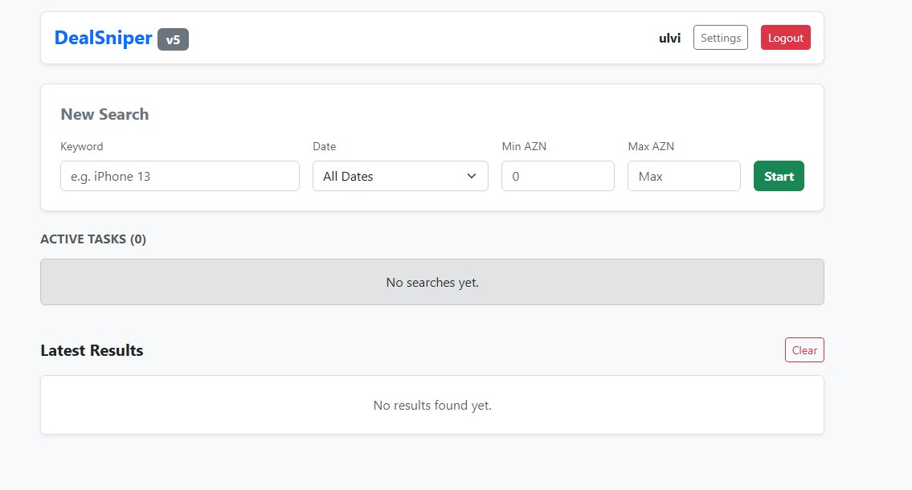

# 🎯 DealSniper - Automated Marketplace Monitor

DealSniper is a powerful, self-hosted web application designed to monitor the **Tap.az** marketplace for specific products. It automatically scrapes listing data, filters by price/date, and sends instant notifications to **Telegram**.



## 🚀 Features

* **🕵️‍♂️ Intelligent Scraping:** Monitors listings in the background without blocking the UI.
* **📱 Telegram Alerts:** Receive instant notifications with product details and links.
* **💻 Web Dashboard:** Clean, responsive Bootstrap interface to manage tasks.
* **⚙️ Advanced Filters:** Filter by Keyword, Price Range (Min/Max), and Date (Today/Yesterday).
* **🛡️ Anti-Detection:** Optimized headers and request delays to prevent IP blocking.
* **🔧 Self-Hosted:** Runs as a Systemd service on Linux (Ubuntu/Debian).

## 🛠️ Installation

You can install DealSniper with a single command on your VPS.

1. Connect to your server (Ubuntu/Debian).
2. Run the following command:

```bash
wget -O install.sh [https://raw.githubusercontent.com/DualStackAdmin/DealSniper/main/install_v5_en.sh](https://raw.githubusercontent.com/DualStackAdmin/DealSniper/main/install_v5_en.sh)
